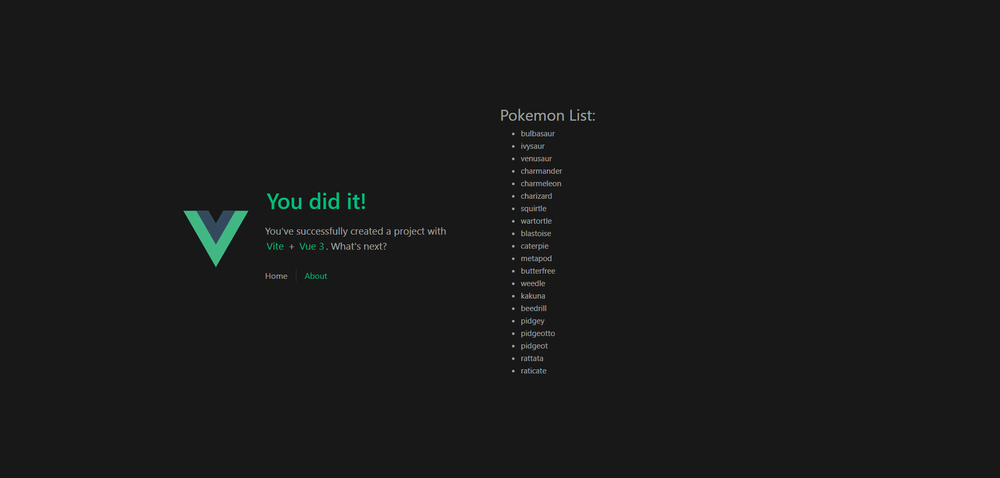
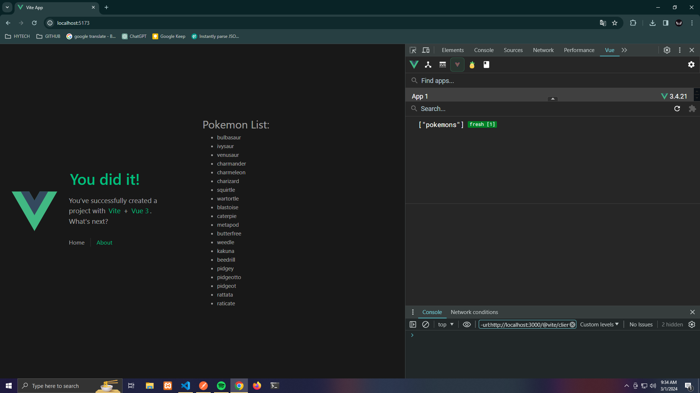
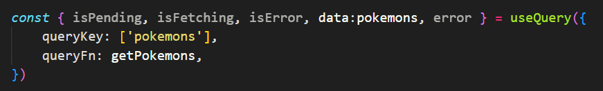
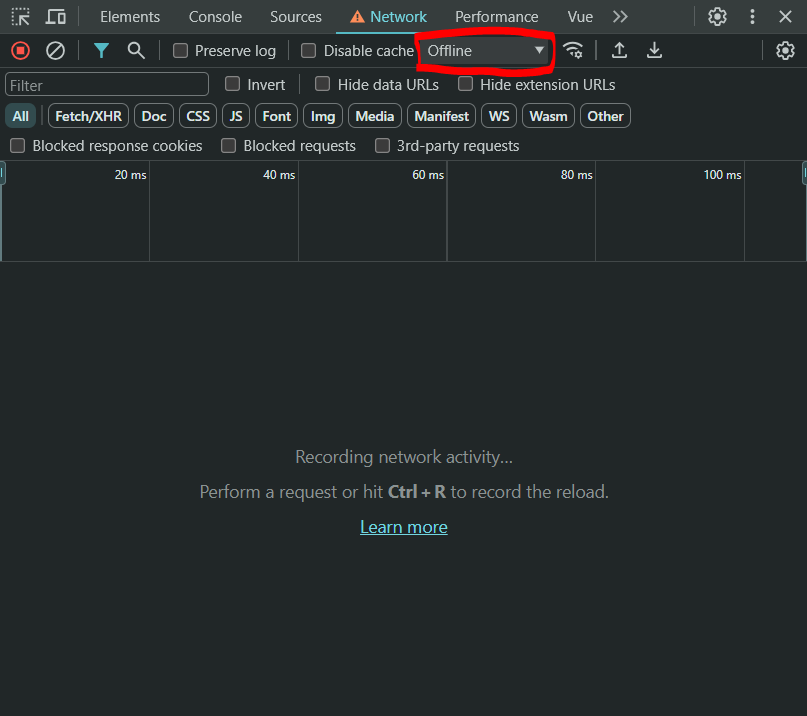
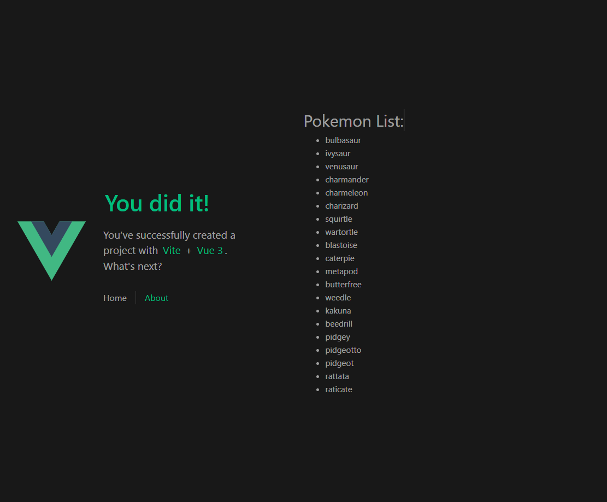
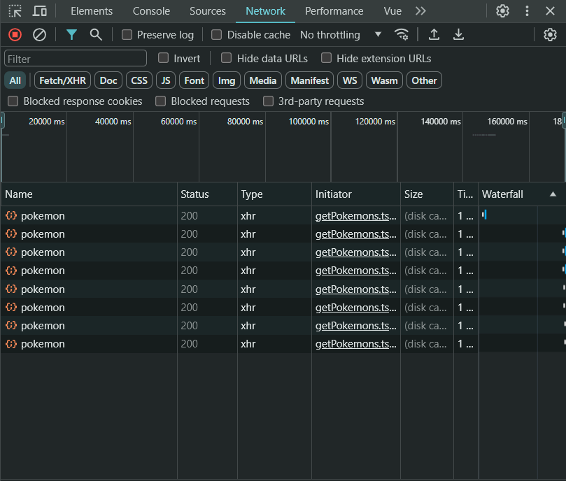

# TanStack Vue Query App

This project was created to test the TanStack library called Vue Query, the purpose is to test this powerful tool with a Vue project to query an API and implement it in future projects.

## Recommended IDE Setup

[VSCode](https://code.visualstudio.com/) + [Volar](https://marketplace.visualstudio.com/items?itemName=Vue.volar) (and disable Vetur) + [TypeScript Vue Plugin (Volar)](https://marketplace.visualstudio.com/items?itemName=Vue.vscode-typescript-vue-plugin).

## Type Support for `.vue` Imports in TS

TypeScript cannot handle type information for `.vue` imports by default, so we replace the `tsc` CLI with `vue-tsc` for type checking. In editors, we need [TypeScript Vue Plugin (Volar)](https://marketplace.visualstudio.com/items?itemName=Vue.vscode-typescript-vue-plugin) to make the TypeScript language service aware of `.vue` types.

If the standalone TypeScript plugin doesn't feel fast enough to you, Volar has also implemented a [Take Over Mode](https://github.com/johnsoncodehk/volar/discussions/471#discussioncomment-1361669) that is more performant. You can enable it by the following steps:

1. Disable the built-in TypeScript Extension
   1. Run `Extensions: Show Built-in Extensions` from VSCode's command palette
   2. Find `TypeScript and JavaScript Language Features`, right click and select `Disable (Workspace)`
2. Reload the VSCode window by running `Developer: Reload Window` from the command palette.

## Customize configuration

See [Vite Configuration Reference](https://vitejs.dev/config/).

## Project Setup

```sh
npm install
```

### Compile and Hot-Reload for Development

```sh
npm run dev
```

### Type-Check, Compile and Minify for Production

```sh
npm run build
```

### Run Unit Tests with [Vitest](https://vitest.dev/)

```sh
npm run test:unit
```

# Vue Query

<p align="center">
  
</p>

## Getting Started With Vue Query

Vue Query is a library designed to simplify and improve the management of data requests in Vue.js applications that interact with RESTful APIs. It provides an easy-to-use interface to query the API, manage related states, and handle data loading logic efficiently.

With Vue Query, developers can easily implement complex data handling logic such as initial loading, periodic updating, and query result caching. The library integrates seamlessly with Vuex, Pinia and follows a hooks-based approach to organize data retrieval and management logic.

Vue Query Documentation: https://tanstack.com/query/latest/docs/framework/vue/installation

## Main Features

- Simplifies handling of data requests in Vue.js applications.

- Provides an easy-to-use interface for querying RESTful APIs.

- Automatically manages the loading, error and success status of queries.

- Allows flexible configuration of query options such as refresh intervals and data caching.

- Integrates well with Vuex for advanced application state management.

## Installation and Initialization

To install Vue Query we must follow the following steps:

### 1. Install Vue Query In The Project

With NPM:

```ssh
npm i @tanstack/vue-query
```

With Yarn:

```ssh
yarn add @tanstack/vue-query
```

### 2. Configure Vue Query in main.ts

We import Vue Query:

```typescript
import { VueQueryPlugin } from "@tanstack/vue-query";
```

We do the Vue Query Configuration:

```typescript
import { createApp } from "vue";

const app = createApp(App);

VueQueryPlugin.install(app, {
  queryClientConfig: {
    defaultOptions: {
      queries: {
        staleTime: 1000 * 60, // HOW LONG THE DATA WILL BE CACHED (1000ms * 60s = 1 minute)
        refetchOnReconnect: "always", // THIS IS FOR WHEN THE INTERNET GOES OUT AND COMES BACK, IT WILL DETECT THAT THE INTERNET HAS RETURNED AND WILL MAKE A NEW CALL TO THE ENDPOINT
      },
    },
  },
});
```

The code would look like this:

```typescript
import "./assets/main.css";

import { createApp } from "vue";
import { createPinia } from "pinia";
import { VueQueryPlugin } from "@tanstack/vue-query";

import App from "./App.vue";
import router from "./router";

const app = createApp(App);

VueQueryPlugin.install(app, {
  queryClientConfig: {
    defaultOptions: {
      queries: {
        staleTime: 1000 * 60,
        refetchOnReconnect: "always",
      },
    },
  },
});

app.use(createPinia());
app.use(router);

app.mount("#app");
```

## Vue Query Usage Example

For the following example we will use the PokeAPI, we are going to make a `GET` request for all the pokemons and for that we are going to point to the following endpoint: `https://pokeapi.co/api/v2/pokemon`

Para este ejemplo vamos a utilizar Axios:

With NPM:

```ssh
npm i axios
```

With Yarn:

```ssh
yarn add axios
```

We create an instance of axios `src/api/pokeApi.ts`

```typescript
import axios from "axios";

const pokeApi = axios.create({
  baseURL: "https://pokeapi.co/api/v2/",
});

export default pokeApi;
```

We can make a `GET` request to `https://pokeapi.co/api/v2/pokemon` and create an interface from the resulting JSON.

JSON:

```json
{
  "count": 1302,
  "next": "https://pokeapi.co/api/v2/pokemon?offset=20&limit=20",
  "previous": null,
  "results": [
    {
      "name": "bulbasaur",
      "url": "https://pokeapi.co/api/v2/pokemon/1/"
    },
    {
      "name": "ivysaur",
      "url": "https://pokeapi.co/api/v2/pokemon/2/"
    },
    {
      "name": "venusaur",
      "url": "https://pokeapi.co/api/v2/pokemon/3/"
    },
    {
      "name": "charmander",
      "url": "https://pokeapi.co/api/v2/pokemon/4/"
    },
    {
      "name": "charmeleon",
      "url": "https://pokeapi.co/api/v2/pokemon/5/"
    },
    {
      "name": "charizard",
      "url": "https://pokeapi.co/api/v2/pokemon/6/"
    },
    {
      "name": "squirtle",
      "url": "https://pokeapi.co/api/v2/pokemon/7/"
    },
    {
      "name": "wartortle",
      "url": "https://pokeapi.co/api/v2/pokemon/8/"
    },
    {
      "name": "blastoise",
      "url": "https://pokeapi.co/api/v2/pokemon/9/"
    },
    {
      "name": "caterpie",
      "url": "https://pokeapi.co/api/v2/pokemon/10/"
    },
    {
      "name": "metapod",
      "url": "https://pokeapi.co/api/v2/pokemon/11/"
    },
    {
      "name": "butterfree",
      "url": "https://pokeapi.co/api/v2/pokemon/12/"
    },
    {
      "name": "weedle",
      "url": "https://pokeapi.co/api/v2/pokemon/13/"
    },
    {
      "name": "kakuna",
      "url": "https://pokeapi.co/api/v2/pokemon/14/"
    },
    {
      "name": "beedrill",
      "url": "https://pokeapi.co/api/v2/pokemon/15/"
    },
    {
      "name": "pidgey",
      "url": "https://pokeapi.co/api/v2/pokemon/16/"
    },
    {
      "name": "pidgeotto",
      "url": "https://pokeapi.co/api/v2/pokemon/17/"
    },
    {
      "name": "pidgeot",
      "url": "https://pokeapi.co/api/v2/pokemon/18/"
    },
    {
      "name": "rattata",
      "url": "https://pokeapi.co/api/v2/pokemon/19/"
    },
    {
      "name": "raticate",
      "url": "https://pokeapi.co/api/v2/pokemon/20/"
    }
  ]
}
```

We create the interface using QuickType: https://app.quicktype.io/
`src/interfaces/pokemon.interface.ts`

```typescript
export interface Pokemons {
  count: number;
  next: string;
  previous: null;
  results: Result[];
}

export interface Result {
  name: string;
  url: string;
}
```

We create a helper that is used to obtain the list of pokemons `src/helpers/getPokemons.ts`

```typescript
import pokeApi from "@/api/pokeApi";
import type { Pokemons } from "@/interfaces/pokemon.interface";

export const getPokemons = async () => {
  const { data } = await pokeApi.get<Pokemons>("pokemon");
  return data;
};
```

In my case I created a hook but you can do this in a component or screen that you want.
`src/composables/usePokemon.ts`

```typescript
import { getPokemons } from '@/helpers/getPokemons';
import { useQuery } from '@tanstack/vue-query';

export const usePokemon = () => {

  const { isPending, isFetching, isError, data:pokemons, error } = useQuery({
    queryKey: ['pokemons'],
    queryFn: getPokemons,
  })

  return {
    pokemons,
  }

}
```

Finally we use the composable that we just created in a component or screen `src/views/HomeView.vue`

```vue
<script setup lang="ts">
import { usePokemon } from '../composables/usePokemon';
const { pokemons } = usePokemon();
</script>

<template>
  <div>
    <h1>Pokemon List:</h1>
    <ul>
      <li v-for="pokemon in pokemons?.results">
        {{ pokemon.name }}
      </li>
    </ul>
  </div>
</template>
```

### Images:

This is what the application looks like running:



We can see the cache that was created using Google Chrome's Vue Devtools:



The cache name `["pokemons"]` comes from `queryKey` of `useQuery` which is in `src/composables/usePokemon.ts`



To see how Vue Query works we must go to the Network section when we inspect the page here we can see all the requests that are made when you enter a page, as we can see in the following example a request was made to the route called `pokemon`.


As we configure the time that the data must remain cached in the `main.ts` we can go from one page to another and the request will not be made every time you enter the page that requires said data.

```typescript
staleTime: 1000 * 60 // 1 minute
```

We configure that the data is kept in cache for 1 minute, so you can exit and re-enter the page and no requests will be made to that route until 1 minute has passed.

Once the minute passes and you exit and re-enter the page you will be able to see that if another request was made to the 'pokemon' route


In the Network tab we can simulate that we do not have internet on the machine, if we select that option we can continue browsing between screens without problem because the data remains cached.





Now in the `main.ts` we configure the following line of code:

```typescript
refetchOnReconnect: 'always'
```

What this line of code does is that when the Internet is cut off, the application data can still be displayed, but the data that is stored in the cache, when it detects that there is internet again, it will make a new request to update the data that are cached in case there were any changes to the API.


## Usage Example Without Using Vue Query

Now what happens if we don't use Vue Query and do it as it is normally done? For this we are going to carry out the following example:

In `src/composables/usePokemon.ts` instead of using useQuery we create a reactive variable and pass the data to it using Vue's onMounted method so that when the component is mounted the request is made, this is how it is normally done:

```typescript
import { getPokemons } from '@/helpers/getPokemons';
import type { Pokemons } from '@/interfaces/pokemon.interface';
import { onMounted, ref } from 'vue';

export const usePokemon = () => {

  const pokemons = ref<Pokemons>();

  onMounted(async () => {
    pokemons.value = await getPokemons();
  })

  return {
    pokemons,
  }

}
```

If we see the screen we can see that it has the same behavior that we saw at the beginning.


But with the inconvenience that every time we leave the page and return, a request will be triggered to 'pokemon' to obtain the list of pokemons, this can be inconvenient in certain cases, for example if the pokeapi were paid and had Limited to only being able to make a few requests, over time the requests we can make will run out, but this also brings more inconveniences such as the excessive number of requests that can make our application have less performance and therefore behave slowly. , among other inconveniences



## Note

*NOTE: Vue Query internally does make the request to the API even if we do not see it, what happens is that it compares the data it has in cache with the data returned by the API and if there is no data in cache it finishes doing the request and puts that data in cache, that is, it creates it, now as a time has been configured in which the data will be kept in cache, Vue Query internally does make the request to verify that the data returned by the API is equal to the that it has in cache, if in any case the data changed in the API even if the established time that was configured has not passed, Vue Query is responsible for finishing making the request and changing the data that it has in cache, if it has not passed the established time and Vue Query does not detect a change in the data returned by the API, then Vue Query waits the established time to make the request again and apply the corresponding changes*